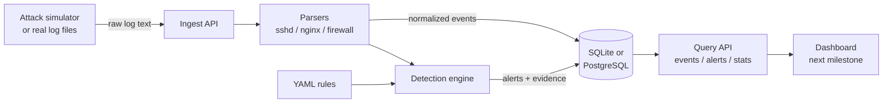

# Mini SIEM

A small security information and event management (SIEM) platform. It ingests raw security
logs, normalizes them into one event schema, runs detection rules over them, and raises
deduplicated, severity-scored alerts with the evidence attached.

Status: the backend is complete and tested. The web dashboard is the next milestone.

## What it does

- **Ingests three log formats** as raw text: SSH/sudo (`auth.log`), nginx/Apache access logs,
  and UFW firewall logs. Pre-structured JSON events are accepted too.
- **Normalizes** every line into a common event (who, from where, did what, when), so one rule
  language works across all sources.
- **Detects attacks** with 11 YAML rules of four kinds: signature match, threshold, distinct
  count, and sequence. Each rule is tagged with its MITRE ATT&CK technique.
- **Raises alerts** that group an ongoing attack into one alert instead of hundreds, carry a
  0-100 risk score, link to the exact events that triggered them, and move through a triage
  workflow (open, acknowledged, resolved, false positive).
- **Simulates attacks** so there is always something to detect: 11 scenarios generate
  realistic log traffic and send it through the full pipeline.



## Quick start

### Without Docker (SQLite)

Needs Python 3.11 or newer.

```bash
cd backend
python3 -m venv .venv && source .venv/bin/activate
pip install -r requirements.txt
uvicorn app.main:app --reload
```

The API is at <http://localhost:8000> and interactive docs at <http://localhost:8000/docs>.
Data goes to `backend/minisiem.db`; delete that file to start over.

### With Docker (PostgreSQL)

```bash
docker compose up --build
```

### See it detect something

In a second terminal, from the repository root:

```bash
python3 simulator/simulate.py
```

```text
brute_force            sshd        40 events stored, 1 new alerts, 0 updated
brute_force_success    sshd        10 events stored, 2 new alerts, 0 updated
port_scan              firewall    30 events stored, 1 new alerts, 0 updated
...
Done: 298 events, 14 alerts raised.
```

Then look at what was raised, highest risk first:

```bash
curl "http://localhost:8000/api/v1/alerts?sort=score"
```

`python3 simulator/simulate.py --list` shows every scenario, and `-s brute_force port_scan`
runs only the ones you name. You can also send a real log file:

```bash
curl -X POST --data-binary @samples/auth.log -H "Content-Type: text/plain" \
     http://localhost:8000/api/v1/ingest/sshd
```

## API

All routes are under `/api/v1`. Full request and response schemas are in the interactive docs.

| Method | Path | Purpose |
| --- | --- | --- |
| POST | `/ingest/{sshd\|nginx\|firewall}` | Ingest raw log text, one event per line |
| POST | `/ingest/events` | Ingest pre-structured events (JSON array) |
| GET | `/events` | Search events: filter by source, action, IP, user, host, time range, text |
| GET | `/events/{id}` | One event |
| GET | `/alerts` | List alerts: filter by status, severity, rule, entity; sort by recency or score |
| GET | `/alerts/{id}` | One alert with its evidence events |
| PATCH | `/alerts/{id}` | Triage: set status and/or leave a note |
| GET | `/rules` | Loaded detection rules with how many alerts each has raised |
| GET | `/stats/summary` | Counts, top source addresses and an event timeline for a time range |
| GET | `/health` | Liveness check (outside `/api/v1`, never requires a key) |

Ingestion is forgiving by design: a malformed line is counted and reported in the response,
and the rest of the batch is still stored.

## Detection rules

Rules live in `backend/rules/*.yml` and are validated at startup; a rule with a typo stops the
server from starting instead of silently never firing.

```yaml
- id: ssh-brute-force
  name: SSH brute force
  severity: high
  type: threshold
  match:
    action: LOGIN_FAILURE
  group_by: [src_ip]          # one alert per attacking address
  window_seconds: 60
  threshold: 5
  summary: "{count} failed SSH logins from {src_ip}"
  mitre: T1110.001
```

| Type | Fires when | Used for |
| --- | --- | --- |
| `match` | an event matches | SQL injection, path traversal, scanner user agents, sensitive sudo commands, root login |
| `threshold` | N matching events fall inside a sliding window | SSH brute force, web content discovery |
| `distinct` | N different values of one field fall inside a window | port scan, password spraying, one account used from many addresses |
| `sequence` | N matching events are followed by a `then` event within a time limit | a brute force that succeeded |

`match` conditions support equality, any-of lists, `regex`, `gte`/`lte`, `in` and `not_in`.
Regexes are also tested against the URL-decoded value, so `%27%20OR%20...` is caught.

## How it is built

- **Python, FastAPI, SQLAlchemy.** The same code runs on SQLite (zero setup) and PostgreSQL
  (Docker); the test suite passes on both.
- **Event time, not arrival time.** The engine reasons about when things happened, so replaying
  an old log file or receiving events out of order gives the same alerts as a live feed.
- **Stateless engine.** After each batch the engine reloads the recent history of only the
  entities that batch touched and re-scans it. Nothing is held in memory between requests.
- **Deduplication.** New evidence for a rule and entity that already has an active alert
  extends that alert. A resolved alert is left alone, so a repeat after triage raises a new one.
- **Risk score.** Severity sets the band (low 20, medium 40, high 70, critical 90) and sustained
  volume adds up to 10 more.
- **Atomic ingestion.** Events and the alerts they cause are committed in one transaction.

## Tests

```bash
cd backend
pip install -r requirements-dev.txt
pytest
```

91 tests cover the parsers, rule validation, every rule type through the real HTTP API, alert
deduplication and triage, and each simulator scenario (asserting it trips exactly the rules it
claims to). To run the suite against PostgreSQL, set `MINISIEM_TEST_DATABASE_URL`. CI runs
lint plus both database runs on every push.

## Configuration

Environment variables, or a `.env` file (see `.env.example`):

| Variable | Default | Meaning |
| --- | --- | --- |
| `MINISIEM_DATABASE_URL` | `sqlite:///./minisiem.db` | SQLAlchemy database URL |
| `MINISIEM_API_KEY` | unset | When set, `/api/v1` requests must send it as `X-API-Key` |
| `MINISIEM_DEFAULT_TIMEZONE` | `UTC` | Zone assumed for syslog lines with no UTC offset |
| `MINISIEM_RULES_DIR` | `backend/rules` | Where detection rules are loaded from |
| `MINISIEM_MAX_LINES_PER_REQUEST` | `10000` | Upper bound on one ingest request |
| `MINISIEM_CORS_ORIGINS` | `["http://localhost:5173"]` | Origins allowed to call the API from a browser |

## Known limits

- Ingesting the same log file twice stores its events twice; there is no duplicate detection.
- Detection runs inline with ingestion, which is simple and consistent but ties ingest speed
  to rule cost. A queue between the two would be the next step at higher volume.
- One shared API key, no user accounts or roles.
- The schema is created at startup with no migration tool.
- No geo-IP data, so there is no "impossible travel" rule; `login-from-many-addresses` covers
  the nearest case.

## Layout

```text
backend/
  app/
    parsers/      one module per log format
    detection/    rule model and loader (rules.py), detection engine (engine.py)
    api/          HTTP routes
    ingest.py     parse, store, detect, commit
    models.py     database tables
  rules/          detection rules (YAML)
  tests/
simulator/        attack scenario generator (standard library only)
samples/          small example log files
```
